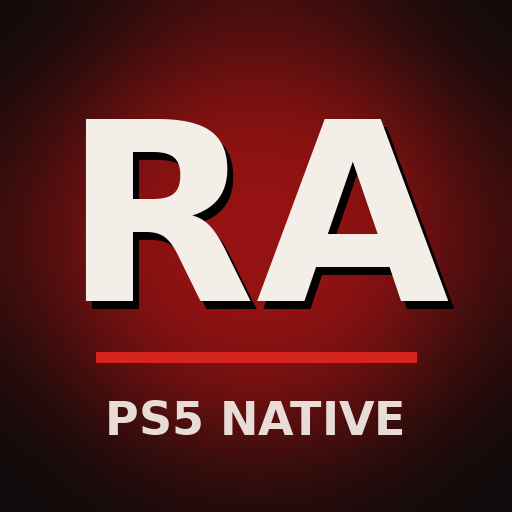

# PS5 Native RA

Westwood's Red Alert (1996) as a native PS5 title: its own home-screen icon, launched like a game,
running [Vanilla Conquer](https://github.com/TheAssemblyArmada/Vanilla-Conquer), the maintained
engine built from the source Electronic Arts released, with the DualSense as the pointer. Bring the
game files: the two discs EA released as freeware in 2008 hold the whole base game, both campaigns,
movies and music; Counterstrike and Aftermath come from your own copy.

**Status (2026-10-06): the title builds and packages; it has not run on a console yet.** For the
first tests the game files are copied to the console by hand. Importing them from a browser, a link
or disc images, the controller layer and the GPU presentation come next ([DEVELOPMENT.md](DEVELOPMENT.md)).

## Requirements

- A jailbroken PS5 with kstuff (fake-signed executables) and
  [ShadowMountPlus](https://github.com/drakmor/ShadowMountPlus).
- Red Alert's game files: the freeware Allied and Soviet disc images, the official demo, or your own
  copy (retail discs, The First Decade, The Ultimate Collection, the Remastered Collection's legacy
  files).

## Install

1. Build `dist/PPSA99096` ([DEVELOPMENT.md](DEVELOPMENT.md)); there is no release yet.
2. Copy the `PPSA99096` folder to `/data/homebrew/` (FTP, ps5upload or USB).
3. ShadowMountPlus registers it within a few seconds and **PS5 Native RA** appears on the home
   screen.

## Your game files

For now, put them in `/data/homebrew/PPSA99096/ra/`, laid out as `ra/README.txt` in the title folder
says. From a disc image (open it with 7-Zip on a PC):

| From | To |
| --- | --- |
| `INSTALL/REDALERT.MIX` (either disc) | `ra/redalert.mix` |
| `MAIN.MIX` of the Allied disc | `ra/allied/main.mix` |
| `MAIN.MIX` of the Soviet disc | `ra/soviet/main.mix` |

One disc is enough to start. Without the files the title shows a notification and closes.

## Controls

Vanilla Conquer's own controller support for now; a layer made for the DualSense comes later.

| Input | Does |
| --- | --- |
| Left stick | The pointer |
| R2 | A faster pointer |
| Right stick | Scroll the map |
| Cross / Circle | Left click / right click |
| Square / Triangle | Guard (G) / formation (F) |
| D-pad | Teams 1 to 4 |
| L1 / R1 | Ctrl / Alt (force fire, force move) |
| Options | Escape: the menu, skipping a movie |

Settings and saves stay on the console (`/download0/ra`).

## Building and internals

See [DEVELOPMENT.md](DEVELOPMENT.md) for the build, the changes to Vanilla Conquer and the plan, and
[RESEARCH.md](RESEARCH.md) for why Vanilla Conquer and where the game data comes from. Licenses and
credits: [LICENSE](LICENSE) (GPL v3) and [THIRD_PARTY_NOTICES.md](THIRD_PARTY_NOTICES.md).
Command & Conquer and Red Alert are trademarks of Electronic Arts; this project is not affiliated
with EA.
